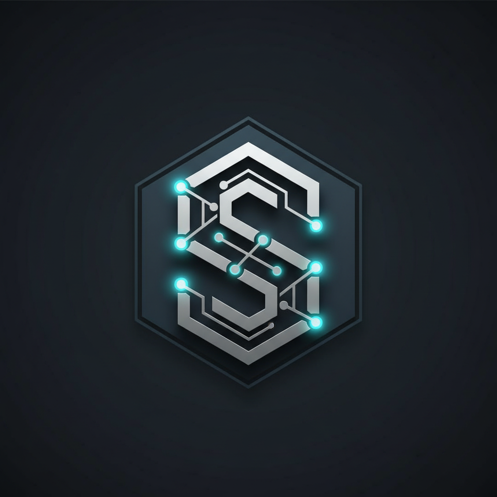

<div align="center">



# CodeScope

**A Claude Code plugin that gives AI deep, persistent understanding of your codebase.**

Analyzes your project's conventions, dependencies, and risk zones so that every AI-generated change fits naturally into your existing code.

[](https://www.npmjs.com/package/codescope)
[](LICENSE)
[](https://nodejs.org)
[](https://www.typescriptlang.org)

<br>

```bash
npx codescope init
```

<br>

*"Every AI session starts from zero. CodeScope fixes that."*

<br>

[The Problem](#the-problem) · [How It Works](#how-it-works) · [Install](#install) · [Commands](#commands) · [MCP Tools](#mcp-tools)

</div>

---

## Install

### As a Claude Code Plugin

```bash
/plugin marketplace add jwadhwa2259/codescope
/plugin install codescope@codescope
```

### As a CLI

```bash
npx codescope init
```

---

## The Problem

When you ask an AI to modify code in an existing project, it starts from zero every time. It doesn't know your naming conventions, your module boundaries, which files are high-risk, or how your imports are structured. The result: code that works in isolation but clashes with everything around it.

CodeScope fixes this by analyzing your codebase once, building a knowledge graph of how everything connects, and then injecting that context into every Claude Code interaction automatically.

---

## How It Works

CodeScope runs as a Claude Code plugin with an MCP server. Once bootstrapped, it works invisibly through Claude Code's hook system:

- **Before every file edit:** Injects the file's conventions, danger zone status, and blast radius into Claude's context
- **After every file edit:** Validates the change against detected conventions and flags violations
- **Before context compaction:** Saves session state so nothing is lost when Claude's context window fills up
- **On session resume:** Restores context from the previous session

You don't need to do anything for this to work. It's invisible.

---

## What You Get

| Feature | Description |
|---------|-------------|
| **Knowledge Graph** | Full dependency map with community detection and centrality analysis |
| **Convention Detection** | Discovers coding patterns with adoption rates and confidence scores |
| **Danger Zone Mapping** | Identifies high-risk files by centrality and coupling |
| **AI Readiness Score** | Grades your codebase on convention coverage, type safety, test coverage, and import health |
| **Blast Radius Analysis** | BFS traversal shows everything affected by a change |
| **Interactive Dashboard** | Explore the graph, conventions, readiness trends, and blast radius in your browser |
| **Autonomous Pipeline** | Research, plan, execute, verify, evaluate, and self-correct -- with only two approval gates |
| **Session Continuity** | Pause and resume analysis workflows across Claude Code sessions |
| **Pre-commit Enforcement** | Optional convention checking on staged files |

---

## Getting Started

### Requirements

- **Node.js 22 or later** -- check with `node --version`
- **Claude Code** -- the CLI, desktop app, or IDE extension

### Step 1: Onboard your project

Open Claude Code in your project directory and run:

```
/codescope:onboard
```

This walks you through a short wizard:
- **Detects your project** -- languages, build commands, test commands, monorepo vs single repo
- **Configures agent models** -- which Claude models to use for different analysis tasks (defaults work fine)
- **Sets workflow preferences** -- how verbose you want the output, how strict convention enforcement should be

### Step 2: Bootstrap (analyze your codebase)

```
/codescope:bootstrap
```

CodeScope scans your project, parses every source file into an AST, builds a knowledge graph, detects conventions, identifies danger zones, and computes an AI Readiness Score. For a typical project, this takes 1-5 minutes.

When it completes, you'll see a readiness report:

```
AI Readiness: B+ (82%)

| Dimension            | Score |
|----------------------|-------|
| Convention Coverage  | 87%   |
| Type Safety          | 91%   |
| Test Coverage Proxy  | 68%   |
| Import Graph Health  | 83%   |
```

### Step 3: You're done

That's it. CodeScope is now active. Every time Claude Code edits or writes a file, CodeScope automatically injects relevant context about that file's conventions, danger level, and blast radius.

---

## Commands

### The Main Workflow

```
/codescope:orient add a caching layer to the user service
```

This runs the full autonomous pipeline:

1. **Clarifies** -- asks targeted questions based on what the knowledge graph reveals
2. **Scopes** -- produces a scope contract listing exactly what will and won't change
3. **Researches** -- looks up any external libraries involved
4. **Plans** -- creates an execution plan with agent assignments
5. **Executes** -- spawns sub-agents to make changes in parallel waves
6. **Verifies** -- runs build, tests, convention checks, and blast radius analysis
7. **Evaluates** -- scores changes on scope compliance, convention adherence, completeness, and correctness
8. **Debugs** -- if evaluation finds issues, automatically attempts to fix them (up to 3 cycles)
9. **Learns** -- captures project-specific insights for future runs

You only step in twice: to approve the scope, and to approve the plan. Everything else is autonomous.

### Quick Flags

- `--no-confirm` -- skip both approval gates. Full autopilot.
- `--no-clarify` -- skip clarification questions if you already know what you want.

### All Commands

| Command | Description |
|---------|-------------|
| `/codescope:onboard` | Guided setup wizard |
| `/codescope:bootstrap` | Run or re-run full codebase analysis |
| `/codescope:orient <task>` | Full autonomous pipeline for a code change |
| `/codescope:review` | Review changes against codebase conventions |
| `/codescope:review <branch>` | Review a specific branch or PR |
| `/codescope:viz` | Launch interactive dashboard at `localhost:7463` |
| `/codescope:pause` | Save pipeline state mid-task |
| `/codescope:resume` | Pick up exactly where you left off |
| `/codescope:review-learnings` | Review accumulated project learnings |
| `/codescope:settings` | Change configuration interactively |
| `codescope init` | CLI: detect project, create config, run bootstrap, wire plugin |
| `codescope bootstrap` | CLI: run or re-run codebase analysis |
| `codescope viz` | CLI: launch interactive visualization dashboard |
| `codescope status` | CLI: show CodeScope health and readiness |
| `codescope install-hooks` | CLI: install pre-commit convention enforcement |

---

## Interactive Dashboard

```
/codescope:viz
```

Opens an interactive dashboard in your browser with five panels:

1. **Graph** -- interactive dependency visualization (zoom, click, filter)
2. **Heatmap** -- convention compliance across your codebase
3. **Trends** -- readiness score history over time
4. **Blast Radius** -- select any file and see what it impacts
5. **Command Center** -- run actions from the dashboard

Use keyboard shortcuts `1-5` to switch panels.

---

## MCP Tools

CodeScope exposes 15 tools via the Model Context Protocol. The skills and hooks use these automatically, but you can also query the knowledge graph directly:

| Tool | Description |
|------|-------------|
| `codescope_status` | Health check -- is CodeScope bootstrapped? |
| `codescope_recall` | Retrieve conventions, learnings, or overview by topic |
| `codescope_graph_query` | Query graph neighbors, paths, or communities |
| `codescope_blast_radius` | BFS blast radius from a file |
| `codescope_conventions` | Get conventions for specific files or modules |
| `codescope_orient` | Lightweight task orientation brief |
| `codescope_verify` | Check convention compliance |
| `codescope_search` | Graph-based code search |
| `codescope_readiness` | AI readiness score |
| `codescope_detect_changes` | Classify working directory changes by risk |
| `codescope_service_map` | Service map for monorepos |
| `codescope_eval` | Evaluate code changes against criteria |
| `codescope_trends` | Readiness trend data |
| `codescope_predict_impact` | Reverse blast radius (what impacts this file?) |
| `codescope_review` | Structural impact analysis for PRs |

---

## What CodeScope Analyzes

| Analysis | What it finds |
|----------|---------------|
| **Knowledge Graph** | Every file, every import, every dependency edge. Community detection groups related modules. Centrality analysis finds the most connected files. |
| **Conventions** | Naming patterns, export styles, error handling approaches, test structures, import ordering -- with adoption rates (e.g., "camelCase: 94% adoption across 312 files"). |
| **Danger Zones** | Files with high in-degree centrality (many things depend on them). Changing these files has outsized impact. |
| **Blast Radius** | For any file, BFS traversal of the dependency graph to find everything affected by a change. |
| **AI Readiness** | A composite score measuring how well-structured the codebase is for AI-assisted changes. |

---

## Supported Languages

- **TypeScript / JavaScript** -- full support (AST parsing, import resolution at 95-99% accuracy, convention detection)
- **Python** -- supported (AST parsing, import resolution at ~80% accuracy, convention detection)

---

## Project Files

CodeScope stores all its data in `.claude/codescope/` inside your project:

```
.claude/codescope/
  config.yml              -- your configuration
  graph.db                -- the knowledge graph database
  conventions-enforced.md -- confirmed conventions
  readiness.md            -- latest readiness score
  learnings.md            -- accumulated project learnings
  services/               -- per-service analysis artifacts
  orient/                 -- task orientation artifacts
  plans/                  -- execution plans
  execution/              -- execution logs and coordination
  reports/                -- verification reports
  sessions/               -- pause/resume handoff files
```

---

## Tech Stack

Built with TypeScript on the same tools Claude Code uses internally:

- **web-tree-sitter** -- AST parsing (WASM, cross-platform)
- **better-sqlite3** -- Knowledge graph storage (synchronous, 2000+ QPS)
- **graphology** -- In-memory graph data structure with community detection and centrality
- **ast-grep** -- Structural pattern matching for convention detection
- **enhanced-resolve** -- TypeScript/JavaScript import resolution
- **@modelcontextprotocol/sdk** -- MCP server framework
- **sigma.js** -- Interactive graph visualization
- **hono** -- Dashboard web server

---

## Tips

- **Run `/codescope:bootstrap` after major refactors** to update the knowledge graph. Small changes are handled incrementally.
- **Start with `suggest-only` convention strictness** (the default). Move to `warn` or `block` once you've reviewed the detected conventions.
- **Use `/codescope:review` before every PR.** It catches cross-community coupling and convention drift that code review alone misses.
- **Review learnings periodically** with `/codescope:review-learnings`. Confirming learnings makes them permanent. Rejecting stale ones frees up capacity (capped at 50 active learnings).

---

## Troubleshooting

| Issue | Fix |
|-------|-----|
| "CodeScope has not analyzed this codebase yet" | Run `/codescope:bootstrap` |
| "No config found" | Run `/codescope:onboard` |
| Bootstrap is slow | First bootstrap of a large codebase (100K+ LOC) can take up to 5 minutes. Subsequent runs are incremental. |
| Convention detection seems wrong | Low-confidence detections (below 80%) are not enforced. Review with `/codescope:review-learnings`. |
| Graph data seems stale | Run `/codescope:bootstrap --force` to rebuild from scratch. Config, conventions, and learnings are preserved. |

---

## License

MIT License. See [LICENSE](LICENSE) for details.

---

<div align="center">

**Claude Code is powerful. CodeScope makes it fit your codebase.**

</div>
